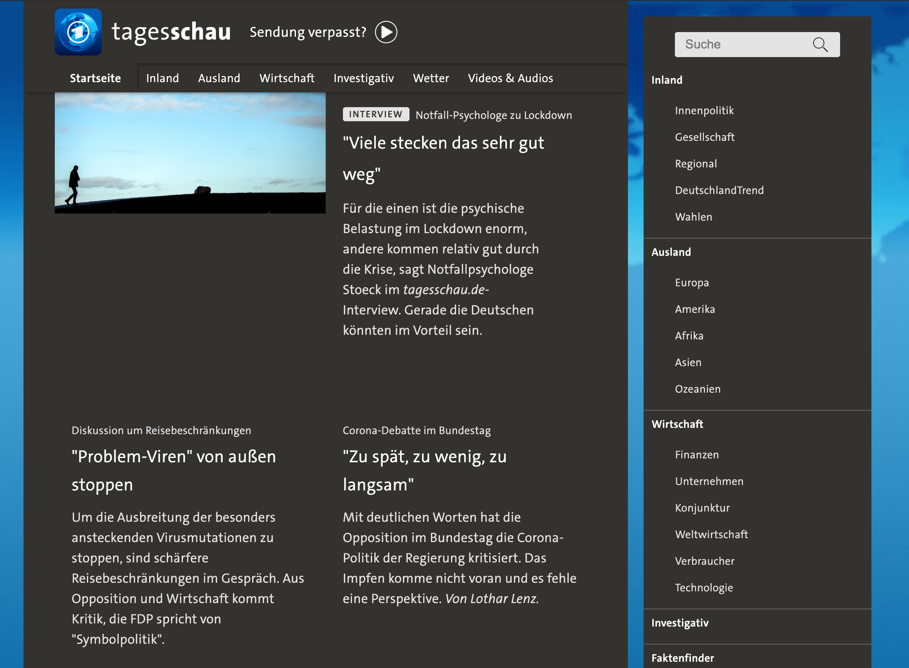

Tagesschau Verdichter

  

Dieses UserCSS bietet verschiedene Optionen, um das neue Layout der Hauptseite von tagesschau.de zu verbessern:

 * Aufreißer-Layout:
   - Zweispaltige Sicht (nur die großen Schlagzeilen haben Bilder)
   - Newsticker ohne Aufreißer-Text, nur Titel
   - Newsticker wie oben, aber ohne Bilder
 * Menü
   - Immer sichtbar links außen
   - Immer sichtbar rechts außen
   - Immer sichtbar rechts innen (schiebt den Inhalt zusammen)
 * Hintergrund
   - Die hübsche blaue Weltkarte

Die Optionen lassen sich nach der Installation einzeln auswählen.
Das UserCSS ist für hinreichend breite Monitore (effektiv mehr als ~1200px Breite) konzipiert, insbesondere die Optionen, die das Menü außerhalb des Inhalts anzeigen.

Es funktioniert sowohl im normalen Modus wie auch im „Darkmode“.

### Lizenz

Dieses Werk ist lizensiert unter den Bedingungen der [WTFPL](/copying.txt).
